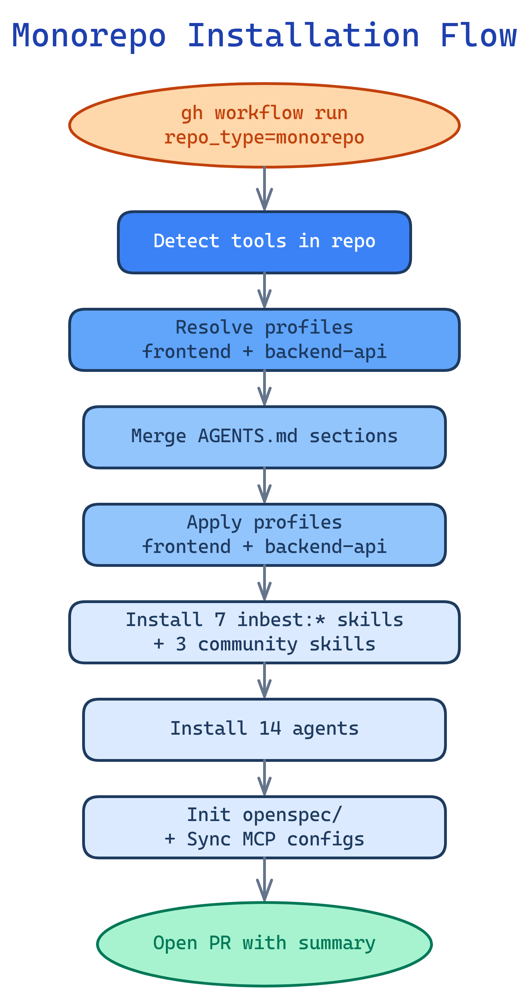
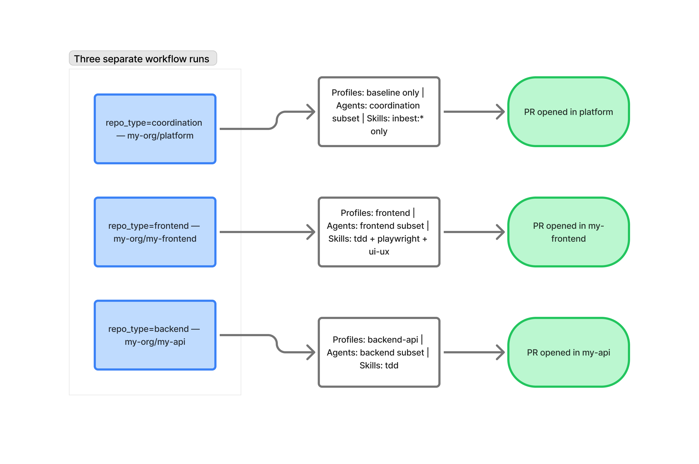

# Rojas SDD Cycle

**Spec-Driven Development standard for Rojas engineering teams.**

Distributes a shared delivery contract across all org repos — spec structure, workflow guardrails, and a 14-agent Claude Code team — without over-configuring them.

---

## What this repo does

- Syncs the SDD baseline (AGENTS.md contract, 7 rojas:* skills + 3 community skills, OpenSpec config) to every repo
- Installs the SDD Dev Suite — 14 Claude Code agents that execute the full SDD cycle
- Provides `repo_type` as a one-flag entry point that auto-composes the right profiles for any topology
- Provides optional profiles for specific repo types (frontend, backend-api, brownfield, high-risk)
- Keeps advanced developer tooling (MCP configs, local memory) **local and opt-in**, never synced

---

## Installation

### Via GitHub Action (recommended)

```yaml
# .github/workflows/sdd-sync.yml
- uses: Sreddx/claude-dev-suit@main
  with:
    agent_suite: 'true'
    agent_suite_version: '1.0.0'
    github_token: ${{ secrets.GITHUB_TOKEN }}
```

Using `repo_type` (recommended entry point — auto-selects profiles):

```bash
# Frontend repo (React/Vue/Angular/Next.js)
gh workflow run sdd-sync-targeted.yml -f repos="my-org/my-frontend" -f repo_type="frontend"

# Backend repo (REST/GraphQL/API)
gh workflow run sdd-sync-targeted.yml -f repos="my-org/my-api" -f repo_type="backend"

# Monorepo (frontend + backend in one repo)
gh workflow run sdd-sync-targeted.yml -f repos="my-org/my-app" -f repo_type="monorepo"

# Brownfield frontend (existing legacy UI)
gh workflow run sdd-sync-targeted.yml -f repos="my-org/legacy-ui" -f repo_type="brownfield-frontend"

# Brownfield backend (existing legacy API)
gh workflow run sdd-sync-targeted.yml -f repos="my-org/legacy-api" -f repo_type="brownfield-backend"

# Coordination/platform repo (baseline only)
gh workflow run sdd-sync-targeted.yml -f repos="my-org/platform" -f repo_type="coordination"
```

With an explicit profile (manual override):

```bash
gh workflow run sdd-sync-targeted.yml \
  -f repos="my-frontend-repo" \
  -f profile="frontend" \
  -f dry_run="false"
```

With a repo role (for multi-repo agent filtering):

```bash
# Coordination repo — gets orchestrator, planner, researcher, validator
gh workflow run sdd-sync-targeted.yml -f repos="my-coord-repo" -f repo_role="coordination"

# Implementation repos — get only their domain agents
gh workflow run sdd-sync-targeted.yml -f repos="my-api-repo" -f repo_role="backend"
gh workflow run sdd-sync-targeted.yml -f repos="my-ui-repo" -f repo_role="frontend"
```

### Manual

```bash
# Copy agents and skills into your project
cp -r agents/claude/ <your-project>/.claude/agents/
cp -r skills/ <your-project>/.claude/skills/
```

### Local developer MCP bootstrap (never synced to repo)

```bash
bash local-packs/bootstrap.sh --tool claude-code --airis-url http://localhost:9400/sse
```

---

## What gets installed

```
.claude/
  agents/         ← 14 SDD Dev Suite agents (force override — managed marker required)
  skills/
    rojas-*/     ← 7 rojas:* skill wrappers (force override)
    test-driven-development/  ← Community: TDD enforcer (force override)
    playwright/               ← Community: Playwright patterns (force override)
    ui-ux-pro-max/            ← Community: UI/UX design intelligence (force override)
  commands/
    sdd.md        ← /sdd entrypoint command
AGENTS.md         ← SDD contract sections (versioned, non-destructive merge)
schemas/
  task-format.md       ← Task checklist format (copy-if-missing)
  approval-gates.md    ← Standardized gate messages (copy-if-missing)
  spec-frontmatter.md  ← Delta spec frontmatter schema (copy-if-missing)
templates/
  openspec/
    progress.md   ← Wave progress tracking template (copy-if-missing)
    handoff.md    ← Implementation handoff template (copy-if-missing)
openspec/
  config.yaml     ← OpenSpec profile (copy-if-missing)
  specs/
  changes/
scripts/
  sdd-preflight.sh      ← Preflight validation (always synced)
  sdd-session-report.sh  ← Session report (always synced)
CLAUDE.md         ← Compatibility pointer (created only if missing)
```

Agent suite is installed by default. Set `agent_suite=false` to skip.

---

## The SDD flow

Every session starts with `/sdd`. The entrypoint runs preflight, shows MCP status, and asks which mode you want.

### 5 modes

| Mode | What it does |
|------|-------------|
| **1 — Plan + implement** | Full cycle: research → spec → **PLAN APPROVAL** → implement → test → **MANUAL TEST GATE** → archive |
| **2 — Implement from plan** | Skip planning, execute an existing `tasks.md` |
| **3 — Research** | Explore + research only, output to `openspec/changes/<n>/research.md` |
| **4 — Bugfix** | Minimal scope, single domain, no full wave execution |
| **5 — Bootstrap** | First-time setup: scans codebase, writes project-stack to AGENTS.md |

### Full cycle (Mode 1)

```
/sdd
  │
  ├─ preflight (bash scripts/sdd-preflight.sh)
  ├─ MCP status report
  │
  ▼
intent classification
  │
  ▼
researcher → openspec/changes/<n>/research.md
  │
  ▼
planner:
  ├─ Figma MCP (if available) → extract component specs, colors, spacing from design file
  ├─ Fallback: mockup image/path provided by developer
  └─ proposal.md + design.md + tasks.md  (frontend tasks include mockup_ref:)
  │
  ▼
┌─────────────────────────────┐
│  PLAN APPROVAL GATE         │  ← developer approves before any code is written
└─────────────────────────────┘
  │
  ▼
team-leader dispatches waves:
  Wave 1:  frontend (Figma MCP → fidelity) + backend + database  (parallel)
  Wave 2:  tester-front + tester-back     (parallel)
  Wave 3:  github-ops (PRs)
  │
  ▼
validator → quality scorecard /18
  │
  ▼
┌─────────────────────────────┐
│  MANUAL TEST GATE           │  ← developer verifies acceptance criteria
└─────────────────────────────┘
  │
  ▼
opsx:archive
```

---

## User Interaction Points

The workflow pauses for human input at the four moments that matter most — before committing to a plan, when the agent is uncertain, before closing a feature, and at the very start of a new greenfield project.

| Trigger | Agent | What the user sees | Expected response |
|---|---|---|---|
| Greenfield project start | orchestrator | 📥 PRD/backlog intake request | Provide PRD and/or backlog |
| Proposal or spec written | planner / orchestrator | 📋 Validation request with artifact path | Approve or give feedback |
| Ambiguity detected | any agent | ❓ Clarification request with specific questions | Answers to unblock the agent |
| Validator passes | validator | ✅ Manual test checklist | Confirm or report issues |

These gates are non-skippable (except for the greenfield gate, which can be bypassed with "proceed without PRD"). No implementation work, task delegation, or sub-agent spawning happens without explicit user approval at the relevant gate.

---

## Starting a New Project

### Greenfield flow

```
1. Install SDD to your new empty repo via GitHub Action
2. Start Claude Code → orchestrator detects greenfield → asks for PRD/backlog
3. You provide PRD + backlog (XLSX, CSV, markdown table, or paste)
4. Orchestrator parses → confirms understanding → asks clarifying questions
5. You approve openspec decomposition and wave plan
6. agent-prep bootstraps AGENTS.md and project-stack
7. Implementation begins wave by wave with approval gates
```

### Brownfield flow

```
1. Install SDD to your existing repo via GitHub Action
2. Start Claude Code → orchestrator detects existing code → runs rojas:explore
3. Code context is built automatically
4. Planning begins from existing context (no PRD required)
```

### Preferred backlog format

| ID | Epic | User Story | Priority | Acceptance Criteria | Technical Notes |
|----|------|------------|----------|---------------------|-----------------|
| US-001-01 | EP-001 | As a [role], I want [goal], so that [reason] | Critical/High/Medium/Low | GIVEN/WHEN/THEN | stack notes |

Accepted formats: XLSX, CSV, Markdown table, Notion/Linear/Jira export, or plain list.

---

## Agent roster

| Agent | Model | Role | MCP |
|-------|-------|------|-----|
| orchestrator | opus | Top-level coordinator | airis-mcp-gateway, serena |
| researcher | opus | Multi-hop research | airis-mcp-gateway, context7 |
| planner | opus | Spec decomposition | airis-mcp-gateway, context7, serena, figma |
| team-leader | opus | Wave coordination | serena |
| frontend | sonnet | UI implementation | context7, figma |
| backend | sonnet | API implementation | context7 |
| database | sonnet | DB/migrations (11 ORMs, CLI-only) | — |
| validator | sonnet | Read-only quality gate | — |
| github-ops | haiku | Git/PR/CI | — |
| devstart | sonnet | Environment bootstrap | context7 |
| tester-front | haiku | e2e + component tests | context7 |
| tester-back | haiku | API + integration tests | context7 |
| agent-sync | sonnet | AGENTS.md state sync | serena |
| agent-prep | sonnet | Project onboarding | airis-mcp-gateway, context7, serena |

**Orchestrator and team-leader cannot write code.** `Write` and `Edit` are disallowed — all changes go through sub-agents.

**No MCP is required.** Every agent falls back to native tools when its MCP is unavailable.

---

## Mono-repo usage

Bootstrap once, then run `/sdd` for every feature:

```
1. Install agents → gh workflow run sdd-sync-targeted.yml -f repos="my-repo"
2. Open Claude Code in your repo
3. Run /sdd → choose Mode 5 (bootstrap) on first use
4. For every feature: /sdd → Mode 1 (plan + implement)
```

All work — specs, tasks, research — lives in `openspec/changes/<feature-name>/`.

---

## Multi-repo usage

For architectures with separate frontend and backend repos, the SDD Dev Suite uses one **coordination repo** to orchestrate work across implementation repos.

### Setup

1. Sync the coordination role to your hub repo:
   ```bash
   gh workflow run sdd-sync-targeted.yml -f repos="my-hub" -f repo_role="coordination"
   ```

2. Sync implementation roles to each impl repo:
   ```bash
   gh workflow run sdd-sync-targeted.yml -f repos="my-api" -f repo_role="backend"
   gh workflow run sdd-sync-targeted.yml -f repos="my-ui" -f repo_role="frontend"
   ```

3. In the coordination repo, enable Agent Teams:
   - Copy `templates/settings/claude-settings.json` to `.claude/settings.json`

4. Enable multi-repo mode in `openspec/config.yaml`:
   ```yaml
   repos:
     api:
       path: ../my-api
       branch_prefix: feat/
     frontend:
       path: ../my-ui
       branch_prefix: feat/
   contracts_dir: openspec/contracts
   ```

### How it works

- All work starts from the **coordination repo** via `/sdd`
- The orchestrator dispatches Agent Teams teammates into each implementation repo
- Backend API tasks run first; contract files land in `openspec/contracts/`
- Frontend tasks unblock once the contracts are ready
- Shared task state lives in `openspec/state/tasks-live.json`
- Each implementation repo is for local bugfixes only (`/sdd Mode 4`)

### Wave structure (multi-repo)

```
Wave 1  database migrations
Wave 2  backend API endpoints + Postman collection + contracts
Wave 3  frontend components consuming contracts
Wave 4  testers (per repo, parallel)
Wave 5  github-ops (per repo, parallel PRs)
Wave 6  validator (cross-repo)
```

---

## Profiles

Use `repo_type` as the recommended entry point — it auto-selects and composes the right profiles for your topology:

| `repo_type` | Auto-applied profiles | When to use |
|---|---|---|
| `frontend` | `frontend` | React/Vue/Angular/Next.js repos |
| `backend` | `backend-api` | REST/GraphQL/API repos |
| `monorepo` | `frontend` + `backend-api` | Single repo with both app and API |
| `brownfield-frontend` | `frontend` + `brownfield` | Existing frontend codebases |
| `brownfield-backend` | `backend-api` + `brownfield` | Existing backend codebases |
| `coordination` | _(baseline only)_ | Platform/infra/orchestration repos |

Individual profiles (used by `repo_type` or set manually via `profile` input):

| Profile | When to use | What it adds |
|---------|-------------|-------------|
| `frontend` | React/Vue/Angular repos | Playwright CLI conventions, GSAP skills, UI verification rules |
| `backend-api` | REST/GraphQL API repos | Contract testing, OpenAPI spec integration |
| `brownfield` | Existing codebases | Mandatory project memory scan before any work |
| `high-risk` | Auth, payments, PII | Human review gates, 2-reviewer PRs, audit trail |

---

## Configuration reference

| Input | Default | Description |
|-------|---------|-------------|
| `repo_type` | — | Topology shortcut (preferred): `frontend`, `backend`, `monorepo`, `brownfield-frontend`, `brownfield-backend`, `coordination` |
| `profile` | — | Explicit profile override: `frontend`, `backend-api`, `brownfield`, `high-risk` |
| `repo_role` | `standalone` | `standalone`, `coordination`, `frontend`, `backend` |
| `agent_suite` | `true` | Install SDD Dev Suite agents |
| `agent_suite_version` | `1.0.0` | Agent version for update tracking |
| `dry_run` | `false` | Preview changes without applying |
| `pr_enabled` | `true` | Create PR vs direct push |
| `pr_prefix` | `sdd-sync` | Branch prefix for sync PRs |
| `target_branch` | — | Override base branch for PRs |
| `tools` | *(auto-detect)* | Force specific tools: `claude-code,cursor,copilot` |

---

## Non-destructive guarantees

| File/path | Behavior |
|-----------|----------|
| `AGENTS.md` | Non-destructive merge via section markers — only `<!-- rojas:section:... -->` blocks are managed |
| `CLAUDE.md` | Non-destructive — only created if missing; existing content is never overwritten |
| `.claude/agents/*.md` | Always override/reinstall — user-created files (no managed marker) are never touched |
| `.claude/skills/*.md` | Always override/reinstall (rojas:* and community skills) |
| MCP configs | Deep JSON merge — existing user keys preserved |
| `openspec/` | Copy-if-missing only |
| `schemas/` | Copy-if-missing — existing schema files are never overwritten |
| `templates/openspec/` | Copy-if-missing — existing template files are never overwritten |
| `scripts/` | Always synced — deterministic utility scripts |

---

## Community Skills

Three drop-in skills are bundled and installed automatically alongside the `rojas:*` skills:

| Skill | Source | Used by agents | When activated |
|---|---|---|---|
| `test-driven-development` | [obra/superpowers](https://github.com/obra/superpowers/tree/main/skills/test-driven-development) | `frontend`, `backend`, `tester-front`, `tester-back` | Any implementation or bugfix task |
| `playwright` | [testdino-hq/playwright-skill](https://github.com/testdino-hq/playwright-skill) | `frontend`, `tester-front` | Any E2E test writing task |
| `ui-ux-pro-max` | [nextlevelbuilder/ui-ux-pro-max-skill](https://github.com/nextlevelbuilder/ui-ux-pro-max-skill) | `frontend` | Any UI/visual implementation task |

**test-driven-development** — Enforces a strict TDD loop: write a failing test, make it pass, refactor. Prevents implementation-first habits that lead to untestable code and gaps in coverage.

**playwright** — Battle-tested Playwright patterns covering locators, fixtures, page object models, network mocking, auth flows, visual regression, accessibility testing, and CI/CD integration (GitHub Actions, GitLab, CircleCI). Includes recipes for React, Next.js, Vue, and Angular.

**ui-ux-pro-max** — Design intelligence for web and mobile: 50+ visual styles, 161 color palettes, 57 font pairings, UX guidelines for 99 patterns, and component recipes across 10 stacks (React, Next.js, Vue, Svelte, SwiftUI, Tailwind, shadcn/ui, and more). Ensures consistent, accessible, and visually polished output from the frontend agent.

Community skills are committed as static files in `skills/community/` and installed to `.claude/skills/` with force override (same as `rojas:*` skills — no version check).

---

## Installation Diagrams

### Monorepo installation flow



### Multi-repo installation flow



---

## Skills reference

### rojas:* skills (Layer 2 wrappers)

| Skill | Purpose |
|-------|---------|
| `rojas:explore` | Codebase exploration + brownfield project memory |
| `rojas:research` | Deep multi-hop research, output to `research.md` |
| `rojas:propose` | Spec creation with API validation + automated plan checks |
| `rojas:implement` | Strategy-first implementation with TDD |
| `rojas:verify` | Isolated quality gate + manual test handoff |
| `rojas:orchestrate` | DAG analysis, wave-based parallel dispatch |
| `rojas:kickstart` | Greenfield project bootstrap: PRD/backlog intake → spec decomposition → wave planning |

### Community skills (bundled)

| Skill | Purpose |
|-------|---------|
| `test-driven-development` | Enforces TDD loop for all implementation and bugfix tasks |
| `playwright` | Battle-tested E2E, API, visual, and a11y testing with Playwright |
| `ui-ux-pro-max` | Design intelligence: styles, palettes, font pairings, UX guidelines |

---

## Observability

Copy `templates/settings/hooks.json` to `.claude/settings.json` (or merge into existing) to enable:
- Per-tool trace logging → `.claude/state/agent-trace.log`
- Validator write/edit blocking (enforces read-only)
- Session summary report on stop (`scripts/sdd-session-report.sh`)

---

## Docs

- [docs/SDD-DEV-SUITE.md](docs/SDD-DEV-SUITE.md) — detailed agent team reference
- [docs/GOVERNANCE.md](docs/GOVERNANCE.md) — escalation triggers and human review gates
- [docs/VERSIONING.md](docs/VERSIONING.md) — versioning and upgrade strategy
- [docs/REPO-TOPOLOGIES.md](docs/REPO-TOPOLOGIES.md) — monorepo, split, multi-repo topologies
- [docs/install/README.md](docs/install/README.md) — OS-by-OS tool installation

---

## License

MIT
